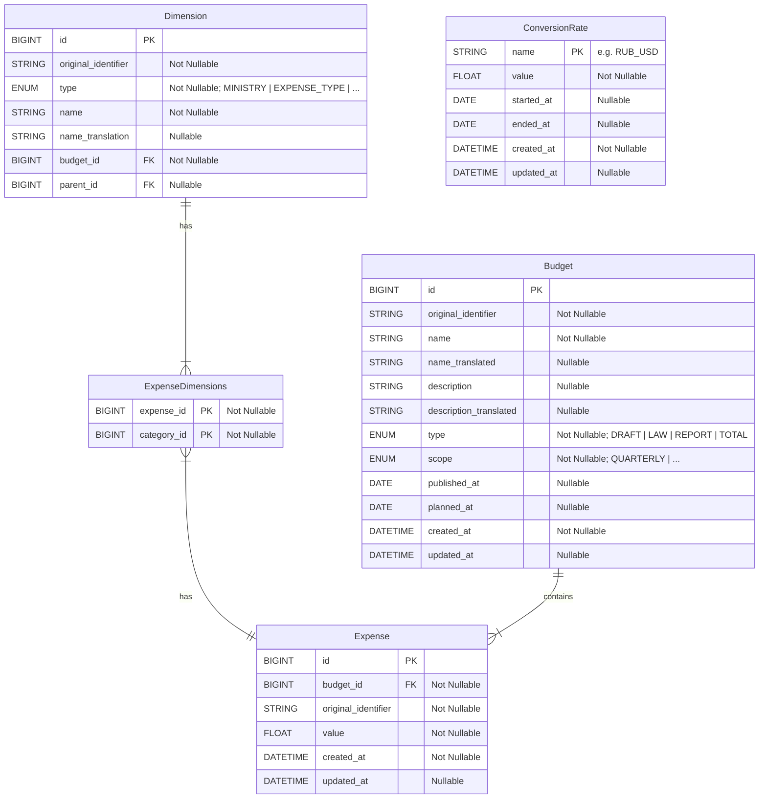

# Haushaltsdashboard - Stiftung Wissenschaft und Politik (SWP)

## Table of Contents
- [Haushaltsdashboard - Stiftung Wissenschaft und Politik (SWP)](#haushaltsdashboard---stiftung-wissenschaft-und-politik-swp)
  - [Table of Contents](#table-of-contents)
  - [Description](#description)
  - [Folders Structure](#folders-structure)
  - [Local Setup Instructions](#local-setup-instructions)
  - [Data Import Instructions](#data-import-instructions)
  - [Database Schema Overview](#database-schema-overview)

## Description
A dashboard application for Stiftung Wissenschaft und Politik (SWP). Dashboard provides insights into budgets and expenditures of the russion government. Includes military spending and classified expenses.

## Folders Structure
- `src/`: Main source code of the application.
  - `alembic/`: Database migration scripts and configurations.
  - `data/`: Data files. Includes Database file as well as raw import data files.
    - `import_files/`: Import files.
  - `database/`: Database connection and session management.
  - `models/`: SQLAlchemy models representing the database schema.
  - `scripts/`: Various scripts used for development and maintenance of the project. Including data import scripts.
  - `settings.py`: Application configuration and settings.
  - `alembic.ini`: Alembic configuration file for database migrations.
  - `app.py`: Main application entry point. 
- `.pre-commit-config.yaml`: Configuration file for pre-commit hooks, ensuring code quality and consistency.
- `README.md`: Project documentation and instructions.
- `pyproject.toml`: Project configuration file, including dependencies and metadata.
- `uv.lock`: Lock file for managing project dependencies with `uv`.
- `Makefile`: Makefile with common commands for development tasks. For example running migrations.


## Local Setup Instructions
1. **Clone the Repository**  
   ```bash
   git clone <repository_url>
   cd ru_budget_tracker
   ```
2. **Set Up Python Environment**  
   Make sure you have [uv installed](https://docs.astral.sh/uv/#installation)
   1. Create a new virtual environment and install dependencies:
      ```bash
      uv sync
      ```
3. **Database Initialization**  
   Initialize the database and run migrations using Alembic via the [Makefile](Makefile):
   ```bash
   make alembic-upgrade
   ```
4. **Import Initial Data**  
   Use the import scripts located in [`src/scripts/`](src/scripts/) to import initial data into the database. Refer to the [example script](src/scripts/example_import_script.py) for guidance.
5. **Run the Application**  
   TO BE ADDED

## Data Import Instructions
Data import scripts are located in the [`src/scripts/`](src/scripts/) directory.
Refer to this [documentation](src/scripts/README.md) for guidance on how to use them.

## Database Schema Overview
