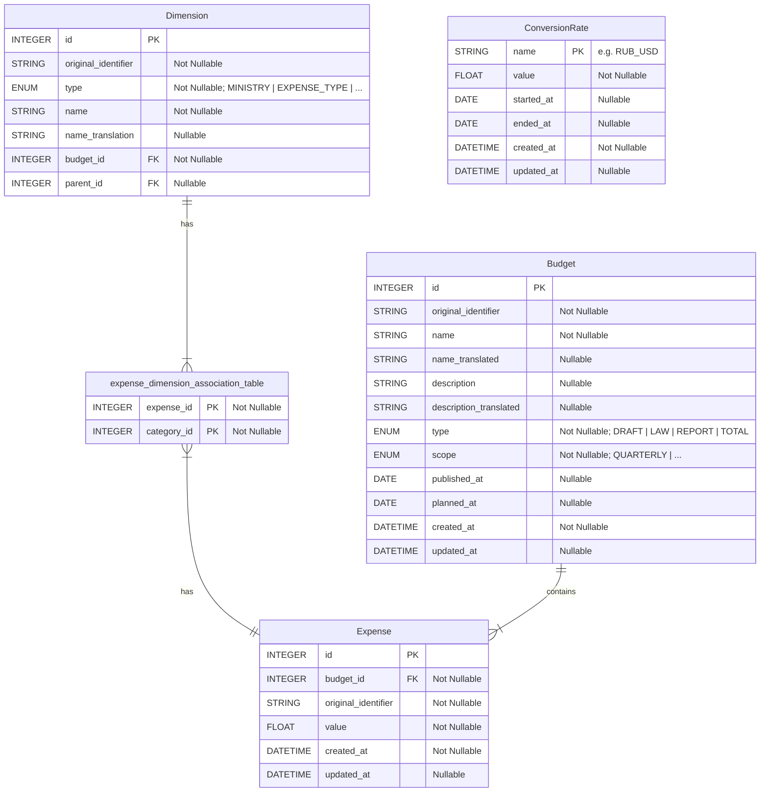

# Haushaltsdashboard - Stiftung Wissenschaft und Politik (SWP)

## Table of Contents

- [Haushaltsdashboard - Stiftung Wissenschaft und Politik (SWP)](#haushaltsdashboard---stiftung-wissenschaft-und-politik-swp)
  - [Table of Contents](#table-of-contents)
  - [Description](#description)
  - [Deployment](#deployment)
  - [Development Guidelines](#development-guidelines)
    - [Git and GitHub](#git-and-github)
    - [Structured Documentation](#structured-documentation)
    - [Code Quality](#code-quality)
  - [Folders Structure](#folders-structure)
  - [Local Setup Instructions](#local-setup-instructions)
  - [Data Import Instructions](#data-import-instructions)
  - [Database Schema Overview](#database-schema-overview)
  
## Description

A dashboard application for Stiftung Wissenschaft und Politik (SWP). Dashboard provides insights into budgets and expenditures of the russion government. Includes military spending and classified expenses.

## Deployment

The deployment pipeline is configured using GitHub Actions. Actions are manually triggered and
deploy the latest changes to the staging environment. The pipeline separates build and deployment
steps for better modularity. In the first step, a Docker image is built and pushed to a container
registry. We use the short SHA of the commit as the image tag. In the second step, the application
is deployed to the staging server using SSH. We use a templated Docker Compose file to ensure
consistency between different environments.

To deploy the latest changes to the staging environment, navigate to the "Actions" tab in the GitHub
repository, select the "Deployment Pipeline" workflow, and click on the "Run workflow" button.
Ensure that you select the appropriate branch from the drop-down before triggering the deployment.
This allows you to deploy changes from different branches as needed.

To update Secrets and Variables used in the deployment pipeline, go to the "Settings" tab of the
GitHub repository,then select "Environments" and select the "Staging" environment. Here, you can add
or modify the necessary Secrets and Variables required for the deployment process.

## Development Guidelines

### Git and GitHub

- **Merge Strategy**: Use feature branches for new features and bug fixes. Merge back into the `develop` when the feature is complete and tested. Only merge into `main` for production releases.
- **Branch Naming**: Use descriptive branch names that reflect the purpose of the branch. For example, use `add-import-script` for adding a new import script or `fix-database-connection` for fixing database connection issues.
- **Commit Messages**: Use clear and descriptive commit messages. You could for example use bulletpoints. This helps in maintaining a clean and understandable project history.

### Structured Documentation

- **README Files**: Each major module or directory should contain a `README.md` file that explains its purpose, usage, and any important details. This helps new developers understand the structure and functionality of the codebase quickly.
- **Code Comments**: Use comments within the code to explain complex logic or important decisions.

### Code Quality

- **Pre-commit Hooks**: Use pre-commit hooks to enforce code quality standards before commits are made. This can include formatting checks, linting, ... [Install pre-commit](https://pre-commit.com/#install) and run `pre-commit install` to set up the hooks before your first commit.

## Folders Structure

- `src/`: Main source code of the application.
  - `alembic/`: Database migration scripts and configurations. Refer to the [respective documentation](src/alembic/README.md) for more details.
  - `data/`: Data files. Includes Database file as well as raw import data files.
    - `import_files/`: Import files.
  - `database/`: Database connection and session management.
  - `models/`: SQLAlchemy models representing the database schema. Refer to the [respective documentation](src/models/README.md) for more details.
  - `scripts/`: Various scripts used for development and maintenance of the project. Including data import scripts. Refer to the [respective documentation](src/scripts/README.md) for more details.
  - `settings.py`: Application configuration and settings.
  - `alembic.ini`: Alembic configuration file for database migrations.
  - `app.py`: Main application entry point.
- `.pre-commit-config.yaml`: Configuration file for pre-commit hooks, ensuring code quality and consistency.
- `README.md`: Project documentation and instructions.
- `pyproject.toml`: Project configuration file, including dependencies and metadata.
- `uv.lock`: Lock file for managing project dependencies with `uv`.
- `Makefile`: Makefile with common commands for development tasks. For example running migrations.

## Local Setup Instructions

1. **Clone the Repository**

   ```bash
   git clone <repository_url>
   cd ru_budget_tracker
   ```

2. **Set Up Python Environment**
   Make sure you have [uv installed](https://docs.astral.sh/uv/#installation)
   1. Create a new virtual environment and install dependencies:

      ```bash
      uv sync
      ```

3. **Database Initialization**
   Initialize the database and run migrations using Alembic via the [Makefile](Makefile):

   ```bash
   make alembic-upgrade
   ```

4. **Import Initial Data**
   Use the import scripts located in [`src/scripts/`](src/scripts/) to import initial data into the database. Refer to the [example script](src/scripts/example_import_script.py) for guidance.
5. **Run the Application**
   TO BE ADDED

## Data Import Instructions

Data import scripts are located in the [`src/scripts/`](src/scripts/) directory.
Refer to this [documentation](src/scripts/README.md) for guidance on how to use them.

## Database Schema Overview


