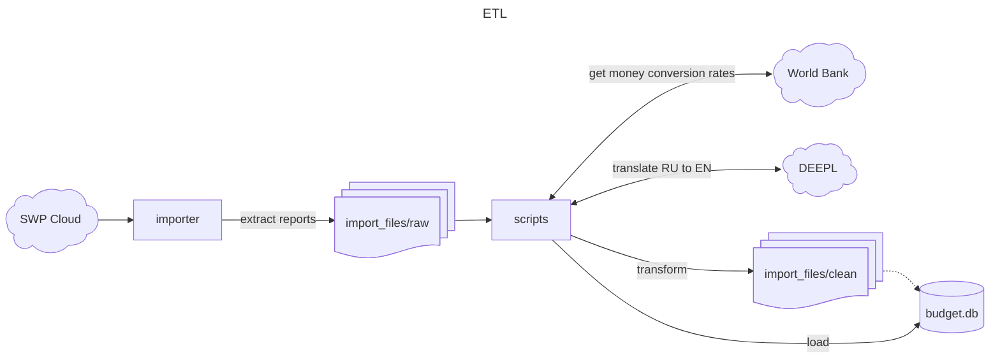
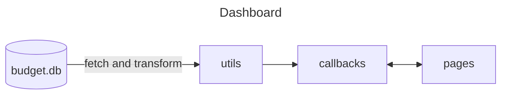
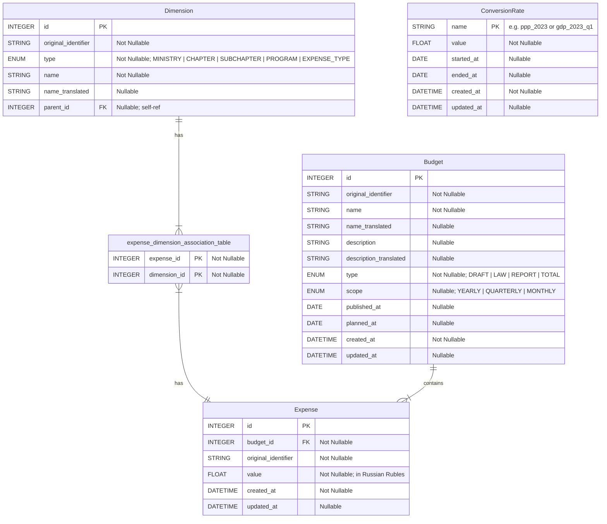
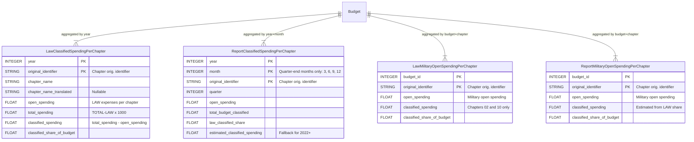

# Haushaltsdashboard - Stiftung Wissenschaft und Politik (SWP)

## Table of Contents

- [Haushaltsdashboard - Stiftung Wissenschaft und Politik (SWP)](#haushaltsdashboard---stiftung-wissenschaft-und-politik-swp)
  - [Table of Contents](#table-of-contents)
  - [Description](#description)
  - [Structure](#structure)
  - [Development Guidelines](#development-guidelines)
    - [Git and GitHub](#git-and-github)
    - [Structured Documentation](#structured-documentation)
    - [Code Quality](#code-quality)
  - [Folders Structure](#folders-structure)
  - [Local Setup Instructions](#local-setup-instructions)
  - [Data Import Instructions](#data-import-instructions)
  - [Database Schema Overview](#database-schema-overview)
    - [Writable Tables](#writable-tables)
    - [View-Backed Read-Only Models](#view-backed-read-only-models)
  - [Importer Component](#importer-component)
    - [How to mount volumes](#how-to-mount-volumes)

## Description

A dashboard application for Stiftung Wissenschaft und Politik (SWP). Dashboard provides insights into budgets and expenditures of the russion government. Includes military spending and classified expenses.

## Structure

The projects consists of two main components:
- ETL (importer and scripts)
- Dash App (follows: fetch → transform → calculate → render approach)


```mermaid
---
title: ETL
---
flowchart LR
DATA@{shape: cloud, label: SWP Cloud}
I[importer]
RAW@{shape: docs, label: import_files/raw}
T[scripts]
BANK@{shape: cloud, label: World Bank}
DEEPL@{shape: cloud, label: DEEPL}
CLEAN@{shape: docs, label: import_files/clean}
DB[(budget.db)]

DATA --> I -->|extract reports| RAW
RAW --> T
T <-->|get money conversion rates| BANK
T <-->|translate RU to EN| DEEPL
T[scripts] -->|transform| CLEAN
CLEAN -.-> DB
T -->|load| DB
```


```mermaid
---
title: Dashboard
---
flowchart LR
DB[(budget.db)]
UTILS[utils]
DB -->|fetch and transform| UTILS
UTILS --> CTRL[callbacks] <--> V[pages]
```

## Development Guidelines

### Git and GitHub

- **Merge Strategy**: Use feature branches for new features and bug fixes. Merge back into the `develop` when the feature is complete and tested. Only merge into `main` for production releases.
- **Branch Naming**: Use descriptive branch names that reflect the purpose of the branch. For example, use `add-import-script` for adding a new import script or `fix-database-connection` for fixing database connection issues.
- **Commit Messages**: Use clear and descriptive commit messages. You could for example use bulletpoints. This helps in maintaining a clean and understandable project history.

### Structured Documentation

- **Module Docs**: Each major module or directory should have a corresponding doc file under [`docs/`](docs/) that explains its purpose, usage, and any important details. This helps new developers understand the structure and functionality of the codebase quickly.
- **Dashboard state fixes**: The shared Treemap/Time Series state, semantic node remapping,
  initial-render guard, and verification checklist are documented in
  [`docs/dashboard-state-and-reload-fixes.md`](docs/dashboard-state-and-reload-fixes.md).
- **Code Comments**: Use comments within the code to explain complex logic or important decisions.

### Code Quality

- **Pre-commit Hooks**: Use pre-commit hooks to enforce code quality standards before commits are made. This can include formatting checks, linting, ... [Install pre-commit](https://pre-commit.com/#install) and run `pre-commit install` to set up the hooks before your first commit.

## Folders Structure

- `src/`: Main source code of the application.
  - `alembic/`: Database migration scripts and configurations. Refer to the [respective documentation](docs/alembic.md) for more details.
  - `assets/`: Static assets served by Dash (icons, CSS). See [`docs/customization.md`](docs/customization.md) for a guide to changing colors, fonts, and toolbar layout.
  - `callbacks/`: All Dash callbacks (shared and page-specific), plus their rendering/data-shaping helpers. Refer to the [respective documentation](docs/callbacks.md) for more details.
  - `data/`: Data files — raw import data files (tracked) and the generated `budget.db` (**not** tracked). Refer to the [respective documentation](docs/data.md) for more details.
    - `import_files/`: Raw source files used by the import scripts.
  - `database/`: Database connection and session management. Refer to the [respective documentation](docs/database.md) for more details.
  - `layout.py`: Top-level Dash app layout and navigation structure.
  - `models/`: SQLAlchemy models representing the database schema, including view-backed read-only models for pre-computed spending aggregates. Refer to the [respective documentation](docs/models.md) for more details.
  - `pages/`: Dash multi-page views (`treemap.py`, `timeseries.py`, `about.py`). Each file defines the layout for one dashboard view; callbacks live in `callbacks/`.
  - `scripts/`: Various scripts used for development and maintenance of the project, including data import scripts and sanity checks. Refer to the [respective documentation](docs/scripts.md) for more details.
  - `utils/`: Shared backend utilities — data fetching, transformation, unit calculation, and chart helpers. Refer to the [respective documentation](docs/utils.md) for more details.
  - `settings.py`: Application configuration and settings.
  - `alembic.ini`: Alembic configuration file for database migrations.
  - `app.py`: Main application entry point. Creates the Dash instance and registers layout and callbacks.
- `.pre-commit-config.yaml`: Configuration file for pre-commit hooks, ensuring code quality and consistency.
- `README.md`: Project documentation and instructions.
- `pyproject.toml`: Project configuration file, including dependencies and metadata.
- `uv.lock`: Lock file for managing project dependencies with `uv`.
- `Makefile`: Common commands for development tasks — database migrations (`alembic-*`) and data import steps (`import-*`).
- `docker-compose.yaml`: Docker Compose file for local testing. Builds the image from source and mounts the local data directory.
- `docker-compose.yaml.j2`: Jinja2 template rendered by the CI/CD pipeline into a `docker-compose.yaml` on the deployment server. The `{{ image_tag }}` variable is substituted with the short commit SHA of the deployed image.

## Local Setup Instructions

1. **Clone the Repository**

   ```bash
   git clone <repository_url>
   cd ru_budget_tracker
   ```

2. **Set Up Python Environment**
   Make sure you have [uv installed](https://docs.astral.sh/uv/#installation)
   1. Create a new virtual environment and install dependencies:

      ```bash
      uv sync
      ```

3. **Get the Data and Build the Database**
   `src/data/budget.db` is **not** part of the repository — it is a build artifact. A fresh
   clone has no database and must build one from the source files hosted on Nextcloud:

   ```bash
   make download-and-bootstrap-data
   ```

   This downloads the raw files, recreates the schema via Alembic, runs the full import and
   the quality report. It requires a `src/.env` file with at least
   `IMPORTER__NEXTCLOUD_DOWNLOAD_LINK` and `IMPORTER__DEEPL_API_KEY` — see
   [`docs/importer.md`](docs/importer.md) and [`src/.env.example`](src/.env.example). Without
   it (or without those secrets) there is no way to obtain the database; ask a maintainer for
   the Nextcloud link.

4. **Import Steps Individually (optional)**
   If the source files are already in place, the import can also be run step by step with the
   `make` targets (in order, from the project root):

   ```bash
   make alembic-upgrade   # create/upgrade the schema
   make import-fix        # fix corrupt source files first
   make import-budget     # import all budget laws and reports
   make import-totals-all # import default report + law totals files
   make import-gdp        # GDP conversion rates
   make import-ppp        # PPP conversion rates
   make import-translations
   ```

   See [`docs/scripts.md`](docs/scripts.md) for full details and options.
5. **Run the Application (without Docker)**
   Start the Dash development server directly:

   ```bash
   cd src && uv run python app.py
   ```

   The dashboard is available at `http://localhost:8050`.

6. **Run the Application (Docker)**
   Start the app locally using Docker Compose, which runs the dashboard behind a Traefik reverse proxy:

   ```bash
   docker compose up --build
   ```

   This uses `docker-compose.yaml`, which:
   - Builds the image locally from `Dockerfile`
   - Mounts `./src/data` into the container so the local database is used
   - Exposes Traefik on `8080` (HTTP → redirects to HTTPS) and `8443` (HTTPS)
   - Exposes the dashboard on `8001` (mapped to container port `8000`)
   - Routes traffic via the `proxy` Docker network

   The dashboard is available at `https://budget_dashboard.docker.localhost:8443` once running.

## Data Import Instructions

For guidance on **obtaining and placing new source files** (budget laws, reports, totals, GDP and PPP conversion tables), see [`docs/data.md`](docs/data.md) and the detailed [`docs/data-import-files.md`](docs/data-import-files.md).

For guidance on **running the import scripts** once source files are in place, see [`docs/scripts.md`](docs/scripts.md).

## Database Schema Overview

Unique identifier for Dimensions:\
`original_identifier` + `type` + `parent_id` + `name`\
This unique identifier is available via join of `Dimension` and `Expense` tables.

### Writable Tables


```mermaid
erDiagram
    Dimension {
        INTEGER id PK
        STRING original_identifier "Not Nullable"
        ENUM type "Not Nullable; MINISTRY | CHAPTER | SUBCHAPTER | PROGRAM | EXPENSE_TYPE"
        STRING name "Not Nullable"
        STRING name_translated "Nullable"
        INTEGER parent_id FK "Nullable; self-ref"
    }
    Dimension ||--|{ expense_dimension_association_table : has
    expense_dimension_association_table {
        INTEGER expense_id PK "Not Nullable"
        INTEGER dimension_id PK "Not Nullable"
    }
    expense_dimension_association_table }|--|| Expense : has
    Expense {
        INTEGER id PK
        INTEGER budget_id FK "Not Nullable"
        STRING original_identifier "Not Nullable"
        FLOAT value "Not Nullable; in Russian Rubles"
        DATETIME created_at "Not Nullable"
        DATETIME updated_at "Nullable"
    }
    Budget ||--|{ Expense : contains
    Budget {
        INTEGER id PK
        STRING original_identifier "Not Nullable"
        STRING name "Not Nullable"
        STRING name_translated "Nullable"
        STRING description "Nullable"
        STRING description_translated "Nullable"
        ENUM type "Not Nullable; DRAFT | LAW | REPORT | TOTAL"
        ENUM scope "Nullable; YEARLY | QUARTERLY | MONTHLY"
        DATE published_at "Nullable"
        DATE planned_at "Nullable"
        DATETIME created_at "Not Nullable"
        DATETIME updated_at "Nullable"
    }
    ConversionRate {
        STRING name PK "e.g. ppp_2023 or gdp_2023_q1"
        FLOAT value "Not Nullable"
        DATE started_at "Nullable"
        DATE ended_at "Nullable"
        DATETIME created_at "Not Nullable"
        DATETIME updated_at "Nullable"
    }
```

### View-Backed Read-Only Models

Pre-computed aggregates managed by Alembic migrations. Never written to directly. Used in places where computing on-the-fly is to slow.


```mermaid
erDiagram
    Budget ||--|{ LawClassifiedSpendingPerChapter : "aggregated by year"
    LawClassifiedSpendingPerChapter {
        INTEGER year PK
        STRING original_identifier PK "Chapter orig. identifier"
        STRING chapter_name
        STRING chapter_name_translated "Nullable"
        FLOAT open_spending "LAW expenses per chapter"
        FLOAT total_spending "TOTAL-LAW x 1000"
        FLOAT classified_spending "total_spending - open_spending"
        FLOAT classified_share_of_budget
    }

    Budget ||--|{ ReportClassifiedSpendingPerChapter : "aggregated by year+month"
    ReportClassifiedSpendingPerChapter {
        INTEGER year PK
        INTEGER month PK "Quarter-end months only: 3, 6, 9, 12"
        STRING original_identifier PK "Chapter orig. identifier"
        INTEGER quarter
        FLOAT open_spending
        FLOAT total_budget_classified
        FLOAT law_classified_share
        FLOAT estimated_classified_spending "Fallback for 2022+"
    }

    Budget ||--|{ LawMilitaryOpenSpendingPerChapter : "aggregated by budget+chapter"
    LawMilitaryOpenSpendingPerChapter {
        INTEGER budget_id PK
        STRING original_identifier PK "Chapter orig. identifier"
        FLOAT open_spending "Military open spending"
        FLOAT classified_spending "Chapters 02 and 10 only"
        FLOAT classified_share_of_budget
    }

    Budget ||--|{ ReportMilitaryOpenSpendingPerChapter : "aggregated by budget+chapter"
    ReportMilitaryOpenSpendingPerChapter {
        INTEGER budget_id PK
        STRING original_identifier PK "Chapter orig. identifier"
        FLOAT open_spending "Military open spending"
        FLOAT classified_spending "Estimated from LAW share"
        FLOAT classified_share_of_budget
    }
```

## Importer Component

Component to import data and generate the budget.db
See [here for documentation](docs/importer.md)

Since `budget.db` is not in the repository, this is the only way the database comes into
existence — locally via `make download-and-bootstrap-data`, and in deployment via the importer
container (`Dockerfile.importer`, whose entrypoint runs the same target). The app container
reads the resulting file from the mounted data volume; it does not ship a database.


### How to mount volumes

| Path                      | Description                               |
| ------------------------- | ----------------------------------------- |
| /app                      | Workdir in App Container, content of src/ |
| data/budget.db            | App loads db from here                    |
| /app                      | Workdir in Importer Container             |
| src/data/import_files/raw | Alembic expects data here                 |


**Mountpoint Example**

```sh
# Importer
/var/lib/data/ru_budget/:/app/src/data/:Z

# App
/var/lib/data/ru_budget/:/app/data/:Z
```
